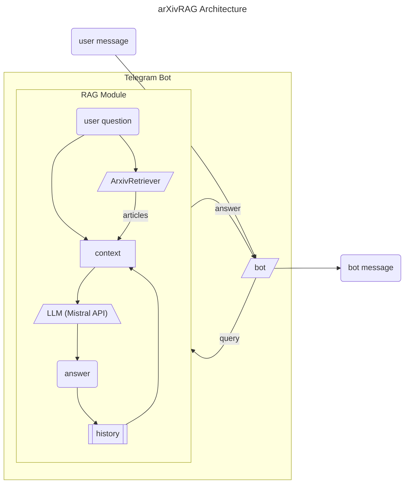

# arXivRAG

arXivRAG is a Retrieval-Augmented Generation (RAG) system designed to enhance research workflows by providing insightful answers to questions based on the latest arXiv research papers. 
This project combines document retrieval with advanced text generation capabilities. 
It leverages LLM API and a `langchain-community` built-in `ArxivRetriever`, to answer complex scientific questions effectively.

## ✨ Key Features
🔍 **Generation Augmented with Retrieval**
Retrieves relevant scientific articles to provide context for generating detailed and accurate answers.

⚙️ **Customizable LLM**
By default uses Mistral API, however other LLMs can also be used, including an implementation of a custom LLM class for [gptunnel.ru](https://gptunnel.ru/).

💬 **Conversation History**
Keeps track of past interactions to ensure coherent and contextually aware responses.

📜 **Prompt Design**
Utilizes a structured prompt template that dynamically integrates:

- Context from retrieved documents
- Conversation history for continuity
- The current user question to tailor responses precisely

## 🗺️ System Architecture

The diagram below summarizes the system architecture:



## ⚖️ Validation

The [validation](https://github.com/BunnyNoBugs/arxiv-rag/blob/experiments/evaluation/rag_evaluation.ipynb) of the RAG assistant was conducted with the LLM-as-judge method using Mistral Large.
The system gave:

- Response vs reference answer: 0.89
- Response vs input: 0.90
- Response vs retrieved docs: 0.67
- Response vs retrieved docs: 0.91

## 🚀 Deployment Instructions

**Telegram Bot Integration**
This project includes a Telegram bot deployment for convenient interaction for users.
Follow these steps to deploy and run the bot:

🛠 **Setup and Configuration**

Ensure you have all required dependencies installed:

```
pip install -r requirements.txt
```

Create a .env file. Example .env:

```
TELEGRAM_BOT_TOKEN=your_telegram_bot_token
MISTRAL_API_KEY=your_mistral_api_key
```

▶️ **Run the Bot**

Start the bot by running the following command:

```
python app.py
```

The bot will connect to Telegram and begin listening for messages.

▶️ **Run the Bot using Docker App**

Build an image from root folder of the repo and run container with that image.
Example:

```
cd arxiv-rag/
docker build -t arxiv-app .
docker run -d --name arxiv-app-bot-app arxiv-rag-python-app
```
